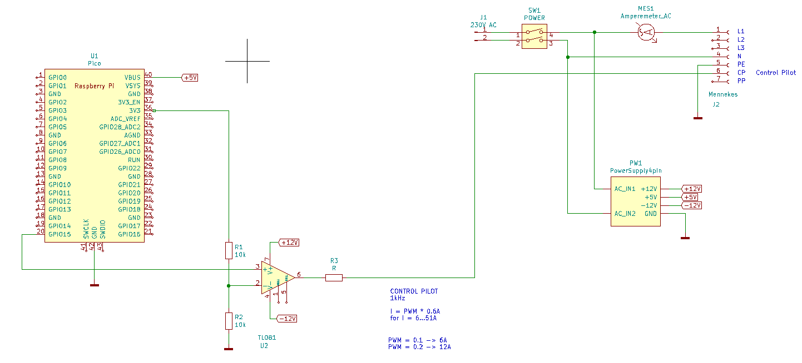

# SimpleEVChargingStation

Ultra simple low power charging station for electric vehicle (EV)

Mostly you want to charge your EV as fast as possible.

In my case I was looking for a solution that would be simple and draw only a small current.

Why this? It is in relation to Solar power for my lab. Sometimes my battery is full and I have more solar energy than i can consume.
It would be nice to use this excess to load several km into our EV. The power should be limited so the 3kW inverter is not too much stressed.

This was an opportunity for me to learn about charging stations, and I came up with this really simple circuit.

A Raspi Pico generates a PWM signal at 1kHz that is used to generate the Control Pilot signal.

The operational amplifier adjusts the level to +12/-12V   (The Low level is only about -10V because of internal voltage drop, but that doesn't seem to do any harm.)

For currents from 6A to 50A, there is a linear relationship between duty cycle and current:   I = PWM * 0.6A

